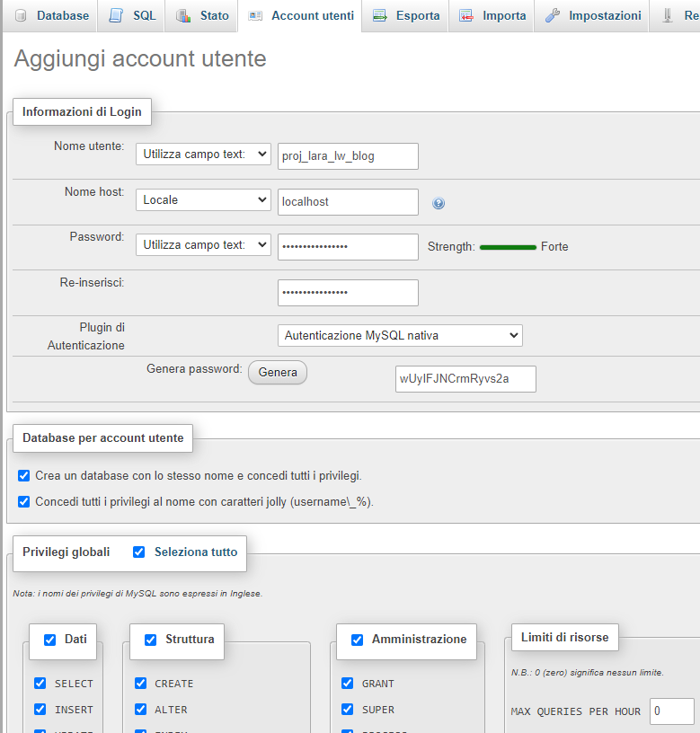

https://www.youtube.com/watch?v=8IrSF8klwQk&list=PLcRnXYmrCwkRiIBDs12yV1Z0CIvUHlCzM&index=4

composer create-project laravel/laravel:^8.0 proj-lara-lw-blog

## Database
- Posso creare un utente nuovo e dargli i permessi solo di questo DB, 
  - Giusto per non usare sempre root (che cmq funzionerebbe lo stesso)
  - proj_lara_lw_blog



## PKG di base: Jetstream, Livewire, Bootstrap, Material Design, Font Awesome
https://jetstream.laravel.com/2.x/installation.html
```
composer require laravel/jetstream
php artisan jetstream:install livewire
```
Questi in realtà li dovrò lanciare alla fine, adesso non servono
```
npm install
npm run dev
php artisan migrate
```

https://popper.js.org/
`npm i @popperjs/core`

https://getbootstrap.com/docs/5.0/getting-started/download/
`npm install bootstrap`

https://mdbootstrap.com/docs/standard/getting-started/installation/
`npm i mdb-ui-kit`

https://fontawesome.com/docs/web/setup/packages#the-free-package
`npm install --save @fortawesome/fontawesome-free`

Alla fine ripeto
```
npm install
npm run dev
php artisan migrate
```

Forse a questo punto potrei pensare di usare Jetstrap, o almeno a fare un checkpoint per ogni nuova installazione
```
php artisan vendor:publish --tag=jetstream-views
npm run dev
```

## Modifica CSS e Bootstrap
https://www.youtube.com/watch?v=moQvrQdruL8&list=PLcRnXYmrCwkRiIBDs12yV1Z0CIvUHlCzM&index=5

Devo far caricare questi pacchetti appena caricati in js/bootstrap.js

## Possibili migliorie
Ho solo index, create e show. Volendo potrei aggiungere altre pagine/metodi. Questo lo potrei taggare
